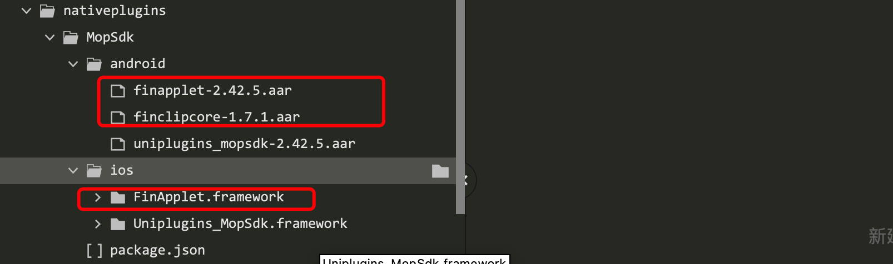
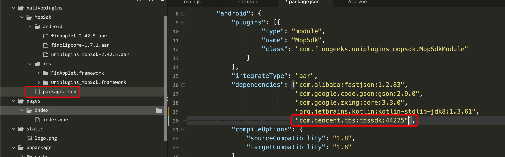
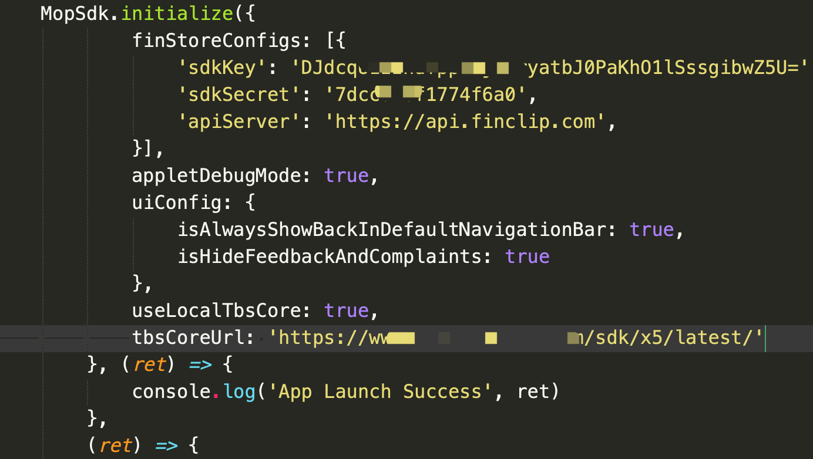

# FinClip-Uniapp-demo

## 介绍
Uniapp APP项目集成FinClip SDK插件，是通过Uniapp官方提供[插件功能](https://nativesupport.dcloud.net.cn/NativePlugin/course/android)文档进行开发,使Uniapp APP项目快速集成FinClip SDK,实现打开FinClip小程序能力。

## 软件架构


## 使用说明
（注本项目资源使用HBuilderX 3.96开发，只集成了FinClip 核心SDK （2.42.5）,如需要更多功能，可使用安卓/IOS源码工程进行开发、扩展后，重新生成插件）

### 1.  引入已经生成好的插件

### 2.  选择插件


 ### 3.  生成自定度基座方便项目调试 （以安卓为例，注意包名需要和获取 生成[SDK KEY 及 SDK SECRET](https://www.finclip.com/mop/document/introduce/functionDescription/application-management.html)的包名一致）


### 4. 在Uniapp项目中初始FinClip SDK

   获取 [SDK KEY 及 SDK SECRET](https://www.finclip.com/mop/document/introduce/functionDescription/application-management.html)

```JavaScript

    const MopSdk = uni.requireNativePlugin('MopSdk')
    export default {
        onLaunch: function() {
            MopSdk.initialize({
                                finStoreConfigs: [{
                                    'sdkKey': '22LyZEib0gLTQdU3MUauAa2CctUv+NxTLFWyPxC28y2gA4x+JWh7hhNS5aO52BFs',
                                    'sdkSecret': '65146ffa924ecfdc',
                                    'apiServer': 'https://api.finclip.com'
                                }]
                             },
                             (ret) => {
                                 console.log('App Launch Success', ret)
                             },
                             (ret) =>{
                                 console.log('App Launch Fail', ret)
                             });
        }
    }
    
```

### 5. 在Uniapp项目中打开小程序

```html
<template>
   <view class="content">
     <image class="logo" src="/static/logo.png"></image>
     <button type="primary" v-on:click="handleOpenMiniProgram">打开小程序</button>
   </view>
</template>

<script>
    const MopSdk = uni.requireNativePlugin('MopSdk');
    export default {
       data() {
          return {
            title: 'Hello'
          }
        },
        onLoad() {
        },
        methods: {
          handleOpenMiniProgram() {
              const apiServer = 'https://api.finclip.com'
              const appId = '5eec56a41464cc0001852e9a'
              MopSdk.openApplet({apiServer,appId})
          }
      }
   }
</script>

 ```

### 6. 如何更新FinClip SDK
 只需要下载最新的[FinClip SDK](https://finclip.com/downloads),替换下图红框内文件后重新生成基座



## 插件API

### 插件SDK初始化

#### 1 插件SDK初始化

##### 参数

| 配置名称| 类型 | 配置描述 |
| --- | -- |--- |
| options | Object | 插件SDK初始化信息 |
| onSuccess | Function | 插件SDK初始化成功回调 |
| onFail | Function | 插件SDK初始化失败回调 |

###### options配置项

| 配置名称| 类型 | 配置描述 |
| --- | -- |--- |
| finStoreConfigs | Array[FinStoreConfig] |小程序服务器配置信息集合 |
| userId | String |当前用户唯一标识，小程序缓存信息会存储在以userId命名的不同目录下，如需在后续逻辑中修改userId，则可以直接使用MopSdk.setUserId("newUserId") |
| productIdentification | String | 产品的标识，配置会将文件夹、UserAgent里的FinClip 等标识改为配置后的值 |
| apmExtendInfo | Array[{key:'aa',value:'aaa'}] | apm统计的扩展信息。|
| disableRequestPermissions | boolean | 是否禁止SDK触发权限申请，默认为false，如果设置为true，则SDK内使用权限的api，不会主动申请权限。|
| appletIntervalUpdateLimit | int | 后台自动检查更新的小程序个数，取值范围：0~50。0代表不检查更新；不设置默认是3。 |
| appletText | String | 小程序文案，默认为“小程序”，你可以设置为"快应用"，"轻应用"|
| customWebViewUserAgent | String | 需要添加至UserAgent中的内容 (仅安卓)|
| enableApmDataCompression | boolean | apm数据上报时,是否压缩数据,默认为false|
| disableGetSuperviseInfo | boolean | 是否禁用SDK的监管接口API，默认为false，如果设置为true，则SDK禁用监管接口API(getSuperviseInfo)|
| appletAutoAuthorize | boolean | 是否允许SDK自动授予小程序权限。默认为false.如果设置为true，则小程序里首次触发权限时不会展示权限弹框|
| appletDebugMode | boolean | 是否开启小程序的vconsole调试,默认为false|
| pageCountLimit | int | 小程序中页面栈个数的最大限制。默认值为0，表示不限制。|
| header | Array[{key:'aa',value:'aaa'}] | 小程序中网络(request/uploadFile/downloadFile)请求的header |
| headerPriority | String | header配置优先级，默认GLOBAL，可选值（SPECIFIED、APPLET_FILE、GLOBAL） |
| ignoreWebviewCertAuth | boolean | 是否忽略SSL证书校验。默认为false，设置为true时，小程序的request、uploadFile、downloadFile、web-view组件可加载不受信任的https链接以及http链接|
| schemes | Array[String] | 自定义的scheme数组。 SDK内部默认支持微信、支付宝、 FinClip App 、tel这些scheme |
| locale | String | sdk 公共UI的语言类型，目前仅支持中文和英文，默认为简体中文,可选值为zh、en |
| uiConfig | UIConfig | 小程序UI配置信息 |
| startCrashProtection | boolean | 是否开启Crash防崩溃，默认为false。UnrecognizedSelector、KVO、Notification、Timer、Container(数组越界，字典插入nil等)、String (越界、nil等)(仅IOS) |
| needToRemoveCookiesDomains | Array[String] | 初始化SDK时需要移除cookies的域名列表 (仅安卓)|
| maxRunningApplet | int | 可同时运行的小程序个数 ，默认为5 (仅安卓)|
| webViewMixedContentMode | int | WebView mixed content mode。可选值0，1，2，其中0为始终不允许非安全加载,0为始终允许加载所有，2为混合加载，允许https加载http(仅安卓) |
| bindAppletWithMainProcess | boolean | 小程序进程是否与app主进程绑定，如果设置为true，则主进程被杀死时，小程序进程同步关闭(仅安卓)|
| killAppletProcessNotice | String | app主进程被杀后关闭小程序的提示文案(仅安卓) |
| minAndroidSdkVersion | int | 最低支持的Android SDK版本 （仅安卓） |
| enablePreNewProcess | boolean | 是否提前创建进程，默认为true （仅安卓） |
| disableTbs | boolean | 是否禁用tbs sdk(仅安卓) |
| useLocalTbsCore | boolean | 是否从本地加载 TBS X5 内核，需要设置为 true(仅安卓) |
| tbsCoreUrl| String | 下载 TBS X5 内核文件的服务器地址 (仅安卓)|

###### FinStoreConfig配置项

| 配置名称| 类型 | 是否必填 | 说明 |
| --- | -- | -- |--- |
| sdkKey | String | 是 |创建应用时生成的sdkKey |
| sdkSecret | String | 是 | 创建应用时生成的sdkKey |
| apiServer | String | 是 | 服务器地址，客户部署的后台地址 |
| apmServer | String | 否 | apm事件上报的服务器地址，不设置时使用apiServer |
| cryptType | String | 否 | 网络接口加密类型。默认为"MD5"，也可以设置为"SM"(国密) |
| fingerprint | String | 否 | SDK指纹，在证联环境时必须传，否则接口访问不通 |
| encryptServerData | Boolean | 否 | 默认为false。目前只能设置为false，设置为true会导致接口访问失败|
| enablePreloadFramework | Boolean | 否 | 默认为true。是否预下载基础库，如果设置为false，则在初始化SDK时关闭预下载基础库|

###### UIConfig配置项

| 配置名称| 类型 | 配置描述 |
| --- | -- |--- |
| navigationBarTitleLightColor | String | 导航栏标题文字浅色颜色，用于深色主题 |
| navigationBarTitleDarkColor | String | 导航栏标题文字深色颜色，用于浅色主题 |
| navigationBarBackBtnLightColor | String | 导航栏返回按钮的浅色颜色，用于深色主题 |
| navigationBarBackBtnDarkColor | String | 导航栏返回按钮的深色颜色，用于浅色主题 |
| isHideFeedbackAndComplaints | boolean | 是否隐藏"更多"菜单中的"反馈与投诉"按钮 |
| isHideBackHome | boolean | 是否隐藏导航栏上的"返回首页"按钮 |
| isHideForwardMenu | boolean | 是否隐藏"更多"菜单中的"转发"按钮 |
| isHideSettingMenu | boolean | 是否隐藏“更多”菜单中的“设置”按钮 |
| isHideRefreshMenu | boolean | 是否隐藏“更多”菜单中的“重新进入小程序”按钮 |
| isHideShareAppletMenu | boolean | 是否隐藏“更多”菜单中的“分享”按钮，默认为true |
| isHideAddToDesktopMenu | boolean | 是否隐藏“更多”菜单中的“添加到桌面”按钮，默认为true |
| isHideFavoriteMenu | boolean | 是否隐藏“更多”菜单中的“收藏”按钮，默认为true |
| hideDebugMenu | boolean | 是否隐藏更多菜单中的调试按钮 |
| hideTransitionCloseButton | boolean | 是否隐藏小程序loading页的关闭按钮 |
| hideCapsuleCloseButton | boolean | 是否隐藏所有小程序右上角胶囊里的关闭按钮 |
| disableSlideCloseAppletGesture | boolean | 是否禁用侧滑关闭小程序手势 |
| moreMenuStyle | int | 更多菜单的样式 |
| autoAdaptDarkMode | boolean | 是否自适应系统深色模式 |
| hideWebViewProgressBar | boolean | 是否隐藏web-view组件加载H5链接时的进度条 |
| webViewProgressBarColor | String | web-view组件加载H5链接时的进度条的颜色 |
| forwadMenuTitle | String | "更多"菜单中"转发"按钮标题 |
| navHomeConfig | NavHomeConfig | 导航栏返回首页按钮的配置|
| capsuleConfig | CapsuleConfig | 胶囊的配置 |
| authViewConfig | AuthViewConfig | 授权弹框配置 |
| navigationBarHeight | Number | 导航栏高度，默认值为44(仅IOS) |
| useNativeLiveComponent | boolean | 是否使用内置的live组件。默认为NO，当设置为YES时，还需要依赖FATAppletLive扩展SDK(仅IOS) |
| navigationBarTitleTextLayoutGravity | String |导航栏标题相对父控件的Gravity(仅安卓) 可选值：Left、Center|
| isAlwaysShowBackInDefaultNavigationBar | boolean |是否始终显示返回按钮(仅安卓) |
| isClearNavigationBarNavButtonBackground | boolean | 是否清除导航栏按钮的背景(仅安卓) |


###### NavHomeConfig配置项

| 配置名称| 类型 | 配置描述 |
| --- | -- |--- |
| width | float | 返回首页按钮宽度，默认44 |
| height | float | 返回首页按钮高度，默认32 |
| leftMargin | float | 返回首页按钮的左边距，默认8 |
| cornerRadius | float | 返回首页按钮边框圆角半径，默认5 |
| borderWidth | float | 返回首页按钮边框宽度，默认0.75 |
| borderLightColor | String | 返回首页按钮浅色边框颜色，默认0X80FFFFFF |
| borderDarkColor | String | 返回首页按钮深色边框颜色，默认0X26000000 |
| bgLightColor | String | 返回首页按钮浅色背景，默认0x33000000 |
| bgDarkColor | String | 返回首页按钮深色背景，默认0x80ffffff|

###### CapsuleConfig配置项

| 配置名称| 类型 | 配置描述 |
| --- | -- |--- |
| capsuleWidth | float |右上角胶囊视图的宽度，默认值为88 |
| capsuleHeight | float |右上角胶囊视图的高度，默认值为32 |
| capsuleRightMargin | float |右上角胶囊视图的右边距 |
| capsuleCornerRadius | float |右上角胶囊视图的圆角半径，默认值为5 |
| capsuleBorderWidth | float |右上角胶囊视图的边框宽度，默认值为0.75 |
| moreBtnWidth | float |胶囊里的更多按钮的宽度，高度与宽度相等，默认为32 |
| moreBtnLeftMargin | float |胶囊里的更多按钮的左边距，默认为6 |
| closeBtnWidth | float |胶囊里的关闭按钮的宽度，注意：高度与宽度相同，默认值32 |
| closeBtnLeftMargin | float |胶囊里的关闭按钮的左边距，默认为6 |
| capsuleBgLightColor | String |胶囊背景颜色浅色，默认为0x33000000 |
| capsuleBgDarkColor | String |胶囊背景颜色浅色，默认为0x80ffffff |
| capsuleBorderLightColor | String |右上角胶囊视图的边框浅色颜色，默认为0x80ffffff |
| capsuleBorderDarkColor | String |右上角胶囊视图的边框深色颜色，默认为0x26000000 |

###### AuthViewConfig配置项

| 配置名称| 类型 | 配置描述 |
| --- | -- |--- |
| appletNameTextSize | float |小程序名称字体大小，默认16 |
| appletNameLightColor | String |小程序名称的浅色颜色，默认#222222 |
| appletNameDarkColor | String | 小程序名称的深色颜色，默认#d0d0d0 |
| authorizeTitleTextSize | float | 权限标题字体大小，默认17 |
| authorizeTitleLightColor | String | 权限标题的浅色颜色，默认#222222 |
| authorizeTitleDarkColor | String | 权限标题的深色颜色，默认#d0d0d0 |
| authorizeDescriptionTextSize | float | 权限描述字体大小，默认14 |
| authorizeDescriptionLightColor | String | 权限描述的深色颜色，默认#5c5c5c |
| authorizeDescriptionDarkColor | String | 权限描述的深色颜色，默认#5c5c5c |
| agreementTitleTextSize | float | 协议标题字体大小，默认16 |
| agreementTitleLightColor | String | 协议标题的浅色颜色，默认#222222 |
| agreementTitleDarkColor | String | 协议标题的深色颜色，默认#d0d0d0 |
| agreementDescriptionTextSize | float | 协议描述字体大小，默认14 |
| agreementDescriptionLightColor | String | 协议描述的浅色颜色，默认#222222 |
| agreementDescriptionDarkColor | String | 协议协议描述的深色颜色，默认#d0d0d0 |
| linkLightColor | String | 链接的浅色颜色，默认#4285f4 |
| linkDarkColor | String | 链接的深色颜色，默认#4285f4 |
| allowButtonLightConfig | AuthButtonConfig | 同意按钮浅色配置，具体见AuthButtonConfig |
| allowButtonDarkConfig | AuthButtonConfig | 同意按钮深色配置，具体见AuthButtonConfig |
| rejectButtonLightConfig | AuthButtonConfig | 拒绝按钮浅色配置，具体见AuthButtonConfig |
| rejectButtonDarkConfig | AuthButtonConfig | 拒绝按钮深色配置，具体见AuthButtonConfig |

###### AuthButtonConfig配置项

| 配置名称| 类型 | 配置描述 |
| --- | -- |--- |
| cornerRadius | float |按钮的圆角半径 |
| normalBackgroundColor | String |按钮默认背景颜色 |
| pressedBackgroundColor | String |按钮按下背景颜色 |
| normalBorderColor | String |按钮默认边框颜色 |
| pressedBorderColor | String |按钮按下边框颜色 |
| normalTextColor | String |按钮默认文字颜色 |
| pressedTextColor | String |按钮按下文字颜色 |

#### 示例

```JavaScript
MopSdk.initialize({
    finStoreConfigs:[{
      'sdkKey': '22LyZEib0gLTQdU3MUauAa2CctUv+NxTLFWyPxC28y2gA4x+JWh7hhNS5aO52BFs',
      'sdkSecret': '65146ffa924ecfdc',
      'apiServer': 'https://api.finclip.com'
    }]
  },
  (ret) => {
    console.log('App Launch Success', ret)
   },
   (ret) =>{
    console.log('App Launch Fail', ret)
   });
 ```
#### 2 使用TBS X5 WebView
SDK 默认使用系统 WebView 加载小程序，同时也支持使用 TBS X5 WebView 加载小程序。使用 TBS X5 内核可以实现部分原生组件的同层渲染，目前支持通过 TBS X5 内核进行同层渲染的原生组件有：

video
live-player
live-pusher
map
input
textarea

启用 TBS X5 WebView 的方法：


依赖 TBS SDK 之后，SDK 内部使用的 WebView 将自动切换为 X5 WebView。SDK 初始化过程中会对 TBS SDK 进行初始化，待 X5 内核加载成功之后，即可使用 X5 内核提供的各种能力。
由于腾讯下发 X5 内核文件有概率受网络状况影响，可能导致 X5 内核下载缓慢或失败，所以 SDK 也支持从自己的服务器下载 X5 内核文件，实现方式如下：

下载 TBS X5 内核文件：
[armeabi 架构 X5 内核文件](https://finclip-homeweb-1251849568.cos.ap-guangzhou.myqcloud.com/sdk/x5/tbs_core_046140_20220915161444_nolog_fs_obfs_armeabi_release.tbs)
[arm64-v8a 架构 X5 内核文件](https://finclip-homeweb-1251849568.cos.ap-guangzhou.myqcloud.com/sdk/x5/tbs_core_046141_20220915165042_nolog_fs_obfs_arm64-v8a_release.tbs)

将下载好的 X5 内核文件上传到自己的服务器，并对上传到服务器后的内核文件重命名：
armeabi 架构 X5 内核文件重命名为：armeabi_release.tbs
arm64-v8a 架构 X5 内核文件重命名为：arm64-v8a_release.tbs
重命名是为了便于 SDK 内部拼接完整的内核文件下载地址。

设置 SDK 初始化配置参数：


经过以上步骤，SDK 初始化的时候就能够从自己的服务器下载 X5 内核文件了。


### 小程序管理

#### 1 小程序生命周期

##### 参数
| 配置名称| 类型 | 配置描述 |
| --- | -- |--- |
| onInitComplete | Function | 小程序初始化完成，首页加载出来的事件 |
| onOpen | Function | 小程序打开完成的事件 |
| onOpenFailure | Function |  小程序出错的事件 |
| onInActive | Function | 小程序进入非活跃状态的事件 |
| onActive | Function |  小程序进入活跃状态的事件 |
| onClose | Function | 小程序关闭完成的事件 |
| onDestroy | Function |  小程序被销毁的事件 |

##### 示例

```JavaScript
MopSdk.setAppletLifecycleCallback(
  (ret) => {
	console.log('onInitComplete', ret)
  },
  (ret) => {
	console.log('onOpen', ret)
  },
 (ret) => {
	console.log('onOpenFailure', ret)
  },
  (ret) => {
	console.log('onInActive', ret)
  },
  (ret) => {
	console.log('onActive', ret)
  },
  (ret) => {
	console.log('onClose', ret)
  },
  (ret) => {
	console.log('onDestroy', ret)
  })
 ```

#### 2 普通打开小程序

##### 参数
| 配置名称| 类型 | 配置描述 |
| --- | -- |--- |
| options | Object | 打开小程序信息 |
| onSuccess | Function | 打开小程序成功回调 |
| onFail | Function | 打开小程序失败回调 |
| onProgress | Function | 打开小程序进度回调 |

options配置项

| 配置名称| 类型 | 配置描述 |
| --- | -- |--- |
| appId | String |小程序id，必填 |
| apiServer | String | 小程序所属服务器，必填 |
| appTitle | String  | 小程序名称，非必填 |
| appAvatar | String | 小程序图标的网络地址，非必填 |
| startParams | Object |小程序启动参数，包含path、query，非必填 |
| schemes | Array[String] | 自定义的scheme数组 |
| hideMiniProgramCloseButton | boolean |是否隐藏小程序页面胶囊里的关闭按钮，默认为false |
| hideMiniProgramMoreButton | boolean |是否隐藏小程序页面胶囊里的更多按钮，默认为false |
| sequence | int | 小程序索引， 非必填 |
| from | int | 来源，数据上报时记录到apm事件中 |
| anim | String | 打开小程序动画，安卓默认RightToLeft，IOS默认BottomToTop,可选值BottomToTop、LeftToRight、TopToBottom、RightToLeft|
| processMode | String |进程模式。枚举类型，默认为 MULTI，即多进程模式，可选值MULTI、SINGLE (仅安卓) |
| taskMode | String |任务参数。枚举类型，默认为 MULTI，即多任务模式，可选值MULTI、SINGLE (仅安卓) |

startParams配置项
| 配置名称| 类型 | 配置描述 |
| --- | -- |--- |
| path | String | 小程序页面路径 |
| query | String | 小程序参数，格式:key=value&key2=value2 |

##### 示例

```JavaScript
    const apiServer = 'https://api.finclip.com'
    const appId = '5eec56a41464cc0001852e9a'
    MopSdk.openApplet({apiServer,appId},
            (ret) => {
                console.log('onSuccess',ret)
            },
            (ret) => {
                console.log('onFail',ret)
            },
            (ret) => {
                console.log('onProcess',ret)
            })

 ```

#### 3 二维码打开小程序

##### 参数
| 配置名称| 类型 | 配置描述 |
| --- | -- |--- |
| options | Object | 打开小程序信息 |
| onSuccess | Function | 打开小程序成功回调 |
| onFail | Function | 打开小程序失败回调 |
| onProgress | Function | 打开小程序进度回调 |

options配置项

| 配置名称| 类型 | 配置描述 |
| --- | -- |--- |
| qrCode | String |二维码内容，必填 |
| from | int | 来源，数据上报时记录到apm事件中 |
| anim | String | 打开小程序动画，安卓默认RightToLeft，IOS默认BottomToTop,可选值BottomToTop、LeftToRight、TopToBottom、RightToLeft|
| appTitle | String  | 小程序名称，非必填（仅安卓）|
| appAvatar | String | 小程序图标的网络地址，非必填 （仅安卓）|
| processMode | String |进程模式。枚举类型，默认为 MULTI，即多进程模式，可选值MULTI、SINGLE （仅安卓） |
| taskMode | String |任务参数。枚举类型，默认为 MULTI，即多任务模式，可选值MULTI、SINGLE  （仅安卓） |
| schemes | Array[String] | 自定义的scheme数组 （仅安卓） |
| hideMiniProgramCloseButton | boolean |是否隐藏小程序页面胶囊里的关闭按钮，默认为false  （仅安卓）|
| hideMiniProgramMoreButton | boolean |是否隐藏小程序页面胶囊里的更多按钮，默认为false  （仅安卓）|
##### 示例

```JavaScript
const qrCode = '' //二维码
MopSdk.openAppletByQrcode({qrCode},
            (ret) => {
                console.log('onSuccess',ret)
            },
            (ret) => {
                console.log('onFail',ret)
            },
            (ret) => {
               console.log('onProcess',ret)
            })
 ```

#### 4 搜索小程序

##### 参数
| 配置名称| 类型 | 配置描述 |
| --- | -- |--- |
| options | Object | 搜索小程序信息 |
| onSuccess | Function | 搜索小程序成功回调 |
| onFail | Function | 搜索小程序失败回调 |
| onProgress | Function | 搜索小程序进度回调 |

options配置项

| 配置名称| 类型 | 配置描述 |
| --- | -- |--- |
| apiServer | String | 服务器地址，必填 |
| text | String  | 搜索小程序内容，必填 |

##### 成功返回值

| 名称| 类型 | 配置描述 |
| --- | -- |--- |
| list | Array[AppletInfo] | 搜索到的小程序集合 |
| total | int  | 搜索到的小程序数量 |

AppletInfo信息

| 名称| 类型 | 配置描述 |
| --- | -- |--- |
| appId | String | 小程序ID |
| appName | String  | 小程序名称 |
| desc | String | 小程序描述信息 |
| highLights | Array[HighLight]  | 高亮字体 |
| organName | String | 企业名称 |
| pageUrl | String  | 小程序搜索到的页面路径 |
| showText | String  |  展示内容 |

HighLight信息

| 名称| 类型 | 配置描述 |
| --- | -- |--- |
| key | String | 高亮字体的key |
| value | String  | 高亮字体的value |

##### 示例

```JavaScript
const apiServer = ''
const text = '' 
MopSdk.searchApplets({apiServer,text},
            (ret) => {
                console.log('onSuccess',ret)
            },
            (ret) => {
                console.log('onFail',ret)
            },
            (ret) => {
               console.log('onProcess',ret)
            })
 ```

#### 5 批量下载小程序

##### 参数

| 配置名称| 类型 | 配置描述 |
| --- | -- |--- |
| options | Object | 批量下载小程序信息 |
| onSuccess | Function | 批量下载小程序成功回调 |
| onFail | Function | 批量下载小程序失败回调 |

options配置项

| 配置名称| 类型 | 配置描述 |
| --- | -- |--- |
| apiServer | String | 服务器地址，必填 |
| appIds | Array[String]  | 需要下载的小程序id数组，必填 |
| isBatchDownloadApplets | boolean | 获取小程序详情后是否下载这些小程序，默认false,非必填 |

##### 成功返回值

| 名称| 类型 | 配置描述 |
| --- | -- |--- |
| -- | Array[AppletDownLoadInfo] | 下载小程序集合 |

AppletDownLoadInfo信息

| 名称| 类型 | 配置描述 |
| --- | -- |--- |
| appId | String | 小程序ID |
| success | boolean  | 小程序是否获取成功 |
| needUpdate | boolean | 是否需要更新本地小程序  true:小程序来源于网络 ; false:小程序本地已经是最新版无需下载 （此字段只有 success 为 true 的时候才有意义） |

##### 示例

```JavaScript
const apiServer = ''
const appIds = [] 
MopSdk.downloadApplets({apiServer,appIds},
            (ret) => {
                console.log('onSuccess',ret)
            },
            (ret) => {
                console.log('onFail',ret)
            })
 ```

#### 6 获取小程序页面截图

##### 参数

| 配置名称| 类型 | 配置描述 |
| --- | -- |--- |
| appId | String  | 小程序ID |
| snapShotWholePage | boolean | 是否截取完整小程序页面（包括可视范围之外） |
| onSuccess | Function | 截图小程序成功回调 |
| onFail | Function | 截图小程序失败回调 |

##### 成功返回值

| 名称| 类型 | 配置描述 |
| --- | -- |--- |
| bitmap | String | 截图的base64值 |

##### 示例

```JavaScript
const appId = ''
const snapShotWholePage = false
MopSdk.captureAppletPicture(
            appId,
            snapShotWholePage
            (ret) => {
                console.log('onSuccess',ret)
            },
            (ret) => {
                console.log('onFail',ret)
            })
 ```

#### 7 将小程序移至前端 （安卓）

##### 参数
| 配置名称| 类型 | 配置描述 |
| --- | -- |--- |
| appId | String  | 小程序ID |

##### 示例

```JavaScript
const appId = ''
MopSdk.moveMiniProgramToFront(appId)
```

#### 8 将APP移至前端

##### 参数
| 配置名称| 类型 | 配置描述 |
| --- | -- |--- |

##### 示例

```JavaScript
MopSdk.moveAppToFront()
```

#### 9 获取当前小程序APPID信息

##### 参数
| 配置名称| 类型 | 配置描述 |
| --- | -- |--- |
| onCallback | Function | 获取小程序APPID成功回调 |

 ##### 成功返回值

| 名称| 类型 | 配置描述 |
| --- | -- |--- |

##### 示例

```JavaScript
MopSdk.currentAppletId((appId) => {

})
```

#### 10 获取当前小程序信息

##### 参数
| 配置名称| 类型 | 配置描述 |
| --- | -- |--- |
| onCallback | Function | 获取小程序成功回调 |

 ##### 成功返回值

| 名称| 类型 | 配置描述 |
| --- | -- |--- |
| appId | String | 小程序id |
| userId | String | 小程序开发者id |
| appAvatar | String | 小程序头像 |
| appTitle | String | 小程序标题 |
| appDescription | String | 小程序描述 |
| appVersion | String | 小程序版本号 |
| appVersionDescription | String | 小程序版本说明 |
| sequence | int | 小程序序列 |
| isGrayVersion | boolean | 是否是灰度版本 |
| appThumbnail | String | 小程序缩略图 |
| groupId | String | 所属组织ID |
| groupName | String | 所属组织名称 |
| appDescription | String | 小程序描述 |
| startParams | Object | 启动参数 |
| cryptInfo | String | 小程序加密信息 |

##### 示例

```JavaScript
MopSdk.currentApplet((ret) => {

})
```

#### 11 获取使用过的指定小程序信息

##### 参数
| 配置名称| 类型 | 配置描述 |
| --- | -- |--- |
| appId | String | 小程序APPID |
| onCallback | Function | 获取小程序信息成功回调 |

##### 示例

```JavaScript
const 
MopSdk.getUsedApplet(appId,(FinApplet) => {

})
```

#### 12 获取使用过的小程序列表

##### 参数
| 配置名称| 类型 | 配置描述 |
| --- | -- |--- |
| onCallback | Function | 获取小程序信息成功回调 |

##### 示例

```JavaScript
const 
MopSdk.getUsedApplets((Array[FinApplet]) => {

})
```

#### 13 判断是否是使用过的小程序

##### 参数
| 配置名称| 类型 | 配置描述 |
| --- | -- |--- |
| appId | String | 小程序APPID |
| onCallback | Function | 获取小程序信息成功回调 |

##### 示例

```JavaScript
const 
MopSdk.isUsedApplet(appId,(isUsed) => {

})
```
#### 14 关闭小程序,小程序会在内存保留

##### 参数
| 配置名称| 类型 | 配置描述 |
| --- | -- |--- |
| appId | String | 小程序APPID |

##### 示例

```JavaScript
    MopSdk.closeApplet(appId);
 ```

#### 15 关闭所有小程序,小程序会在内存保留

##### 参数
| 配置名称| 类型 | 配置描述 |
| --- | -- |--- |

##### 示例

```JavaScript
 MopSdk.closeApplets()
 ```

#### 16 结束小程序,从内存移除

##### 参数

| 配置名称| 类型 | 配置描述 |
| --- | -- |--- |
| appId | String | 小程序APPID |

##### 示例

```JavaScript
    MopSdk.finishRunningApplet(appId);
 ```

#### 17 结束所有小程序,从内存移除,

##### 参数

| 配置名称| 类型 | 配置描述 |
| --- | -- |--- |

##### 示例

```JavaScript
    MopSdk.finishRunningApplets();
 ```

#### 18 清除小程序（从本地缓存中移除）

##### 参数

| 配置名称| 类型 | 配置描述 |
| --- | -- |--- |
| appId | String | 小程序APPID |

##### 示例

```JavaScript
    MopSdk.clearApplet(appId);
 ```

#### 19 清除所有小程序（从本地缓存中移除）

##### 参数

| 配置名称| 类型 | 配置描述 |
| --- | -- |--- |

##### 示例

```JavaScript
    MopSdk.clearApplets()
 ```

### 小程序自定义API管理

#### 1 注册自定义api

##### 参数

| 配置名称| 类型 | 配置描述 |
| --- | -- |--- |
| apiName | String | 自定义API名称 |
| callback | Function | 自定义API回调函数 |

##### 获取APP接收参数
| 配置名称| 类型 | 配置描述 |
| --- | -- |--- |
| uuid | String | 唯一标识 |
| event | String | 事件名称 |
| appId | String | 小程序ID |
| params | Object | 小程序传参 |

##### 示例

```JavaScript
    MopSdk.registerExtensionApi(
       // 自定义api名移
       apiName,
       (ret) => {
          console.log('onCallback',ret)

          //处理失败/成功处理，返回对应参数
          MopSdk.onSuccess(ret.uuid,{

          })
          //失败
          //MopSdk.onFail(ret.uuid,{})
       }
    );
 ```

#### 2 取消注册自定义api （仅安卓）

##### 参数

| 配置名称| 类型 | 配置描述 |
| --- | -- |--- |
| apiName | String | 自定义API名称 |

##### 示例

```JavaScript
    MopSdk.unRegisterExtensionApi(apiName);
 ```

 #### 3 注册web-view自定义api

##### 参数

| 配置名称| 类型 | 配置描述 |
| --- | -- |--- |
| apiName | String | 自定义API名称 |
| callback | Function | 自定义API回调函数 |

##### 示例

```JavaScript
    MopSdk.registerWebExtentionApi(
       // 自定义api名移
       apiName,
       (ret) => {
           console.log('onCallback',ret)
            //成功
            MopSdk.onSuccess(ret.uuid,ret)
          //失败
          //MopSdk.onFail(ret.uuid,ret)
       }
    )
 ```

#### 4 取消注册web-view自定义api （仅安卓）
 
##### 参数

| 配置名称| 类型 | 配置描述 |
| --- | -- |--- |
| apiName | String | 自定义API名称 |

##### 示例

```JavaScript
    MopSdk.unRegisterWebExtensionApi(apiName)
 ```

### 小程序代理管理

#### 1 设置小程序button的open-type获取用户头像
 
##### 参数

| 配置名称| 类型 | 配置描述 |
| --- | -- |--- |
| chooseAvatar | String | 头像 |

##### 示例

```JavaScript
    MopSdk.setChooseAvatar(chooseAvatar)
 ```


#### 2 设置小程序button的open-type获取用户手机号
 
##### 参数

| 配置名称| 类型 | 配置描述 |
| --- | -- |--- |
| phoneNumber | String | 手机号 |

##### 示例

```JavaScript
    MopSdk.setPhoneNumber(phoneNumber)
 ```

 #### 3 设置小程序button的open-type设置分享触发代理
 
##### 参数

| 配置名称| 类型 | 配置描述 |
| --- | -- |--- |
| shareCallback | Function | 分享触发代理回调 |

##### 示例

```JavaScript
    MopSdk.setOpenTypeShareAppMessage((ret) => {

    })
 ```

#### 4 设置小程序菜单分享触发代理
 
##### 参数

| 配置名称| 类型 | 配置描述 |
| --- | -- |--- |
| shareCallback | Function | 分享触发代理回调 |

##### 示例

```JavaScript
    MopSdk.setShareAppMessage((ret) => {

    })
 ```

 #### 5 设置小程序button的open-type或getUserProfile获取用户信息
 
##### 参数

| 配置名称| 类型 | 配置描述 |
| --- | -- |--- |
| options | Object | 用户信息 |

##### 示例

```JavaScript
    MopSdk.setShareAppMessage({
      name: 'xxx',
      sex: '',
      ...
    }）
```

 #### 6 设置小程序自定义菜单按钮

 ##### 参数

| 配置名称| 类型 | 配置描述 |
| --- | -- |--- |
| options | Array[MenuItem] | 菜单信息 |
| onRegisteredMoreMenuItemClicked | Function | 菜单点击回调 |

MenuItem配置
| 配置名称| 类型 | 配置描述 |
| --- | -- |--- |
| id | String| 菜单标识 |
| title | String | 菜单名称 |
| image | String | 菜单图标 |
| type | String | 菜单类型，默认COMMON，可选值COMMON、ON_MINI_PROGRAM |
| isEnable | boolean | 是否可点击，默认ture |

##### 示例

```JavaScript
    const  options = [{
        id: 'caidan',
        title: '菜单',
        image: 'https:///ddddd.jpg',
        type: 'ON_MINI_PROGRAM',
        isEnable: true
    }]
    MopSdk.setRegisteredMoreMenuItems(options，(ret)=>{

    }）
```

#### 7 设置小程序灰度值

 ##### 参数

| 配置名称| 类型 | 配置描述 |
| --- | -- |--- |
| options | Array[GrayItem] | 菜单信息 |

GrayItem配置
| 配置名称| 类型 | 配置描述 |
| --- | -- |--- |
| key | String| 灰度规则ID标识 |
| value | String | 灰度值 |

##### 示例

```JavaScript
    const  options = [{
        key: '',
        value: ''
    }]
    MopSdk.setGrayAppletVersionConfigs(options）
```

### 小程序WebView管理

#### 1 获取当前小程序webView的URL

 ##### 参数

| 配置名称| 类型 | 配置描述 |
| --- | -- |--- |
| onSuccess | Function | 获取当前小程序webView的URL成功回调 |
| onFail | Function | 获取当前小程序webView的URL失败回调 |
| onProgress | Function | 获取当前小程序webView的URL进度回调 |

##### 示例

```JavaScript
    MopSdk.getCurrentWebViewURL(
      (ret)=>{

      },
      (ret)=>{

      },
      (ret)=>{

      })
```

#### 2 获取当前小程序webView的userAgent

 ##### 参数

| 配置名称| 类型 | 配置描述 |
| --- | -- |--- |
| onSuccess | Function | 获取当前小程序webView的userAgent成功回调 |
| onFail | Function | 获取当前小程序webView的userAgent失败回调 |
| onProgress | Function | 获取当前小程序webView的userAgent进度回调 |

##### 示例

```JavaScript
    MopSdk.getCurrentWebViewUserAgent(
      (ret)=>{

      },
      (ret)=>{

      },
      (ret)=>{
        
      })
```

#### 3 设置webView的指定url的cookies(仅安卓)

##### 参数

| 配置名称| 类型 | 配置描述 |
| --- | -- |--- |
| appId | String | 小程序appId|
| url | String | webview的url |
| cookies | String | cookies |

##### 示例

```JavaScript
    MopSdk.setWebViewCookie({
      appId,
      url,
      cookies
    })
```

#### 4 删除指定url的Cookie(仅安卓)

##### 参数

| 配置名称| 类型 | 配置描述 |
| --- | -- |--- |
| appId | String | 小程序appId|
| url | String | webview的url |

##### 示例

```JavaScript
    MopSdk.removeWebViewCookie({
      appId,
      url
    })
```

#### 5 删除所有Cookie(仅安卓)

##### 参数

| 配置名称| 类型 | 配置描述 |
| --- | -- |--- |
| appId | String | 小程序appId|

##### 示例

```JavaScript
    MopSdk.removeWebViewAllCookie({
      appId
    })
```

### 小程序事件管理

#### 1 原生发送事件给小程序

##### 参数
| 配置名称| 类型 | 配置描述 |
| --- | -- |--- |
| appId | String | 小程序appId|
| params | Object | 发送的参数|

##### 示例

```JavaScript
    MopSdk.sendCustomEvent(appId, {

    });
```

#### 2、原生发送事件给所有小程序

##### 参数
| 配置名称| 类型 | 配置描述 |
| --- | -- |--- |
| params | Object | 发送的参数|

##### 示例

```JavaScript
    MopSdk.sendCustomEventToAll({
        
    });
```

### 小程序其它管理

#### 1、设置小程序当前的用户标识，一般在APP登录后用于小程序数据隔离（ft.getStroage）

##### 参数
| 配置名称| 类型 | 配置描述 |
| --- | -- |--- |
| userId | String | 当前APP登录用户唯一标识|

##### 示例

```JavaScript
    MopSdk.setUserId(userId);
```

#### 2、转换小程序文件路径为绝对路径

##### 参数
| 配置名称| 类型 | 配置描述 |
| --- | -- |--- |
| appId | String | 小程序appId |
| finPath | String | 小程序文件路径(如拍照、下载后路径) |
| onCallback | Funtion | 转换成功后回调 |

##### 成功返回值
| 配置名称| 类型 | 配置描述 |
| --- | -- |--- |
| path | String | 绝对路径 |

##### 示例

```JavaScript
    MopSdk.getFinFileAbsolutePath(appId,finPath,(ret) =>{
        
    });
```

### 扩展SDK其它管理

如需集成以下扩展SDK，需要先将[扩展SDK](https://finclip.com/downloads)放置插件目录，并在SDK初始化时调用以下方法进行注册。

#### 1 注册扩展SDK

##### 示例

```JavaScript
    MopSdk.registerExtSDK()
```

#### 2 注册百度地图SDK

##### 参数
| 配置名称| 类型 | 配置描述 |
| --- | -- |--- |
| key | String | 百度key |

##### 示例

```JavaScript
    MopSdk.registerBDMapSDK(key)
```

#### 3 注册高德地图SDK
##### 参数
| 配置名称| 类型 | 配置描述 |
| --- | -- |--- |
| key | String | 高德key |

##### 示例

```JavaScript
    MopSdk.registerGDMapSDK(key)
```

#### 4 注册腾讯地图SDK
##### 参数
| 配置名称| 类型 | 配置描述 |
| --- | -- |--- |
| key | String | 腾讯key |

##### 示例
 
```JavaScript
    MopSdk.registerTXMapSDK(key)
```

#### 5 注册蓝牙SDK

##### 示例
 
```JavaScript
    MopSdk.registerBluetoothSDK()
```

#### 6 注册联系人SDK

##### 示例
 
```JavaScript
    MopSdk.registerContactSDK()
```

#### 7 注册贴粘板SDK

##### 示例
 
```JavaScript
    MopSdk.registerClipboardSDK()
```

#### 8 注册直播SDK

##### 示例
 
```JavaScript
    MopSdk.registerLiveSDK()
```

#### 9 注册日历SDK

##### 示例
 
```JavaScript
    MopSdk.registerCalendarSDK()
```

## 插件拓展

### 安卓插件拓展

请将工程内的andriod.zip进行解压，使用android studio打开解压后的安卓项目
#### 1、安卓插件生成，可参考下图


#### 2、如需要拓展SDK的API，可可参考下图


#### 3、在调试插件中，如需更新FinClip SDK生成，可如下图引入新的SDK


### IOS插件拓展
请将工程内的ios.zip进行解压，并下载xcode依赖SDK库下载地址   

[和彩云，提取码: 8yLu](https://caiyun.139.com/w/i/115CeVBRPMhah)    
[百度网盘，提取码: vi3f](https://pan.baidu.com/share/init?surl=LsuqsRYa46GrMbIumcMKbw&pwd=vi3f)   

将下载SDK.zip进行解压并将SDK->SDK->Libs目录拷贝至当前项目SDK目录，然后使用xcode打开项目，


#### 1、IOS插件生成，可参考下图


#### 2、如需要拓展SDK的API，可参考下图


#### 3、在调试插件中，如需更新FinClip SDK生成，可如下图引入新的SDK,重新打开IOS项目
